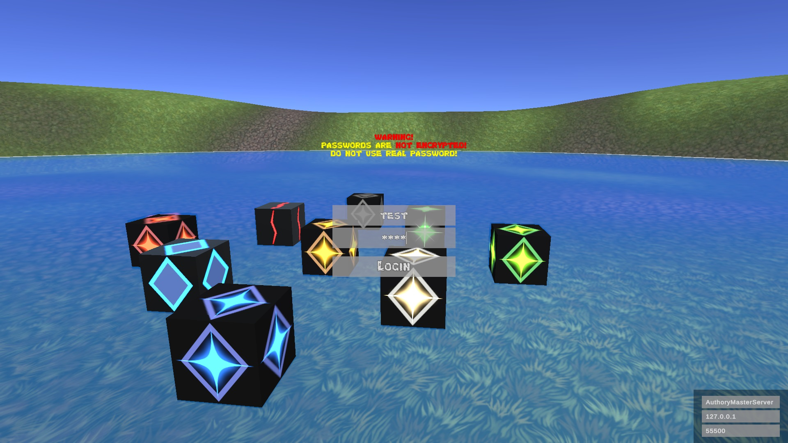
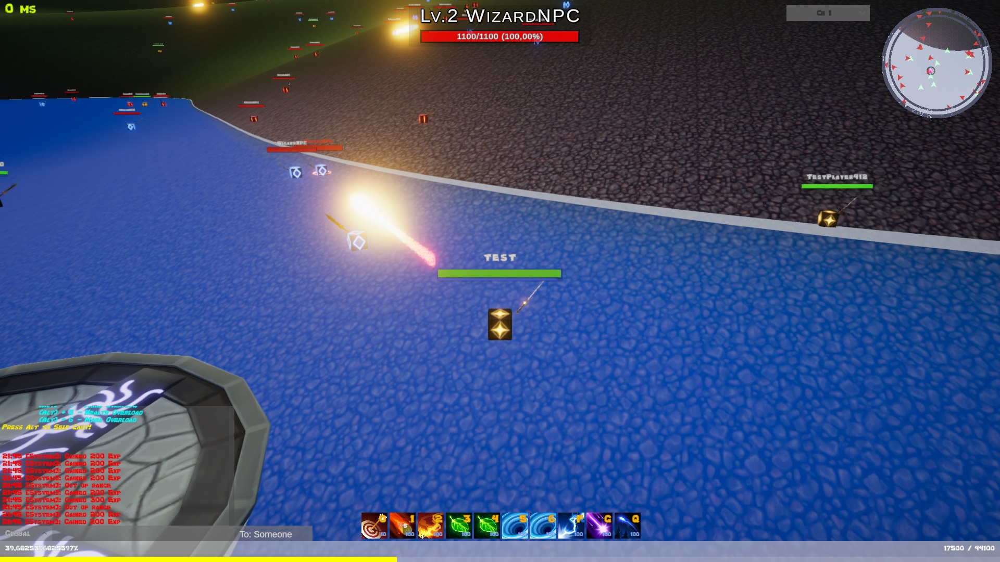

# Authory
 This project was made at Budapest University of Technology and Eonomics for my BSc degree as an IT Engineer

# README
To run the server you will need a MySql (version 8.0.22) server, and a user that has read and write privileges, with the authentication plugin set to "Standard".
In the you will find a "CreateAuthorySchema.sql" DDL file, with this you will be able to create the required tables, with the correct schema name.

Both servers has their own configuration file. If the server at startup can not find its config file, it will ask for your inputs. If you set the inputs from the running software it will generate the config file for the next startup. The configs files has to be next to the .exe in the folder structure.
In the client (bottom-right corner), on the login screen you can define the MasterServer's IP address, port number, and the AuthString of the AuthoryMasterServer.

# AuthoryServer config file
#### #Server details:

- MapsFolderPath: Defines the location of the folder where the maps files can be found. The server will load the server side entities from this file.
- ServerAuthString: This string has to be the same as in the client on the bottom-right corner on the character selection screen.
- IsServerRunningLocalHost: This value can be True/False. If the value is set to True, the server will send the local IP address to the MasterServer, otherwise it will use download its network public IP address from https://api.ipify.org this webpage contains the public IP address of the network from its called.
- ServerPort: Defines the server port of the server node (Not the map server, the map servers are running under the server node). If you are running both the AuthoryMasterServer and the AuthoryServer on the same machine, the ServerPort of the AuthoryMasterServer and this ServerPort must not match.

#### #MasterServer details:
- MasterServerAuthString: The AuthString of the AuthoryMasterServer and this must match.
- MasterServerHost: The node will search for the AuthoryMasterServer on this IP address.
- MasterServerPort: The node will search for the AuthoryMasterServer on this port.

# AuthoryMasterServer config file
#### #Server details:
- ServerAuthString: The AuthString of the AuthoryServer and this must match.
- ServerPort: The server will start on this port.
#### #DatabaseDetails:
- DBServer: The IP address of the MySql database server.
- DBName: The database schema ("authory") if you are using the attached .sql query.
- DBUser: The database user with read and write privileges to the authory schema.
- DBPassword: The password of the DBUser for the database.

# Pictures from the game

